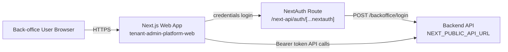
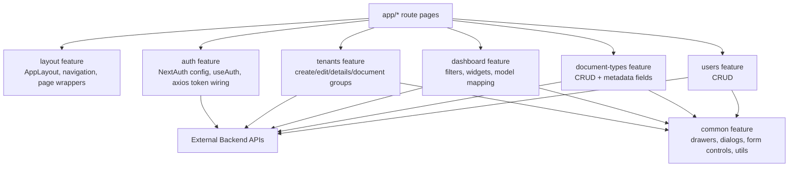
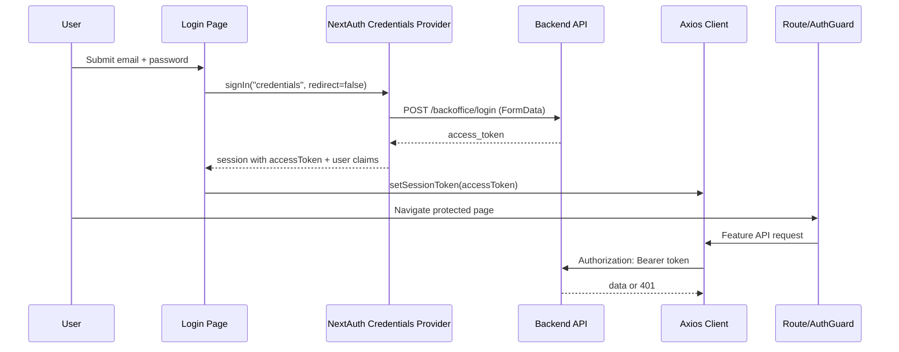
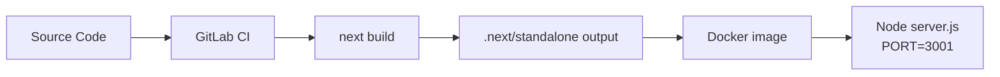

# Tenant Admin Platform Web - Architecture Design

## 1. Purpose and Scope

This document describes the implemented architecture of `tenant-admin-platform-web` (Next.js 14 + TypeScript), based on the current source code.

Primary responsibilities:

- Authenticate back-office users.
- Provide tenant administration workflows.
- Provide configuration workflows (document types and users).
- Provide AI usage dashboard analytics.

## 2. Technology Stack

- Framework: Next.js `14` (App Router)
- UI: React `18`, Material UI `7`, Carbon icons
- Auth/session: `next-auth` credentials provider (JWT session strategy)
- Data fetching/caching: `@tanstack/react-query`
- HTTP client: `axios` with centralized interceptors
- Forms: `react-hook-form`
- Charts: `recharts`
- Styling: MUI theme system + `sass`
- Build target: Next standalone output (`next.config.mjs -> output: "standalone"`)

## 3. High-Level System Context



Notes:

- The app does not manage domain persistence itself; all business data is served by external backend APIs.
- `next-auth` is used as the web session boundary; backend token is stored in JWT session and injected into API requests.

## 4. Runtime Composition

## 4.1 App Shell

- Root layout (`src/app/layout.tsx`) composes:
  - `InitColorSchemeScript`
  - `ClientProviders` (`SessionProvider` + `QueryProvider`)
  - `AuthGuard`
  - `AppLayout` (Topbar + SideNavbar + content region)
- Login route is rendered without side navigation/topbar chrome.

## 4.2 Route Structure

```text
/login
/dashboard
/tenants
/tenants/create
/tenants/[id]
/settings/document-types
/settings/users
/next-api/auth/[...nextauth]
```

## 4.3 Feature-Oriented Module Layout



## 5. Authentication and Session Flow

## 5.1 Design

- Credentials login is configured in `src/features/auth/api/authOptions.ts`.
- `authorize()` submits form data to backend endpoint `/backoffice/login`.
- Access token is decoded to get `sub` and `name`, then stored in JWT callback/session callback.
- `ClientProviders` observes session and sets in-memory Axios session token (`setSessionToken`).
- Axios request interceptor adds `Authorization: Bearer <token>`.
- Axios response interceptor signs out on `401` for non-login endpoints.
- `AuthGuard` redirects:
  - unauthenticated users to `/login`
  - authenticated users away from `/login` and `/` to `/dashboard`

## 5.2 Sequence



## 6. Data Access Architecture

## 6.1 API Client Layer

- Single shared Axios instance in `src/features/auth/api/axiosConfig.ts`.
- `baseURL` is `process.env.NEXT_PUBLIC_API_URL`.
- Feature API modules define endpoint-specific calls:
  - Tenants: `/admin/accounts`, `/admin/account/{id}/document-groups`, `/admin/users`, `/admin/config`
  - Dashboard: `/admin/ai-usage-dashboard`
  - Document types: `/admin/document-types`
  - Users: `/backoffice/users`

## 6.2 Query/Mutation Layer

- All read/write operations are wrapped in React Query hooks.
- Query keys are centralized per feature constants.
- Mutations invalidate list/detail keys to refresh stale UI state.

CRUD pattern:

1. UI submits form/event.
2. Hook mutation calls API module.
3. On success, invalidates related query keys.
4. Table/details view re-renders from refreshed cache.

## 7. Core Domain Workflows

## 7.1 Tenant Creation Workflow (Multi-Step)

`CreateTenant` orchestrates a multi-step wizard and submits the tenant at Preview step.

Step order:

1. General details
2. Brand and theming
3. AI services
4. SSO
5. Documents
6. Preview & create tenant (calls create tenant API)
7. Document groups
8. Add user (required to finish)
9. Success

```mermaid
flowchart TD
    A[Start Create Tenant] --> B[Fill Steps 1-5 in react-hook-form]
    B --> C[Preview Step]
    C --> D[Transform request body<br/>theming/sso/doc types/integrations/data sources]
    D --> E[POST /admin/accounts]
    E --> F[Store returned accountId in CreateTenantContext]
    F --> G[Manage Document Groups<br/>/admin/account/{id}/document-groups]
    G --> H[Create Initial User<br/>POST /admin/users]
    H --> I[Finish]
```

Key architectural choice:

- Tenant creation is split into staged operations with `accountId` propagated via `CreateTenantContext` after tenant creation succeeds.

## 7.2 Tenant Details/Edit Workflow

- Tenant details page loads `GET /admin/accounts/{id}`.
- Each section (general, branding, AI services, SSO, documents) opens drawer-based inline edit.
- `EditTenant` computes section-scoped request bodies and calls `PATCH /admin/accounts/{id}`.
- Document groups are managed separately via dedicated group APIs.

## 7.3 Dashboard Workflow

- Dashboard loads:
  - tenant list (`useGetTenants`)
  - admin config (`useGetAdminConfig`) for period options
  - usage data (`useGetAiUsage`) keyed by selected filters
- Filter changes are debounced (`300ms`) before querying.
- Response is mapped into model classes for chart-friendly structures.

## 8. Theming and White-Labeling

- MUI `ThemeProvider` is global in `AppLayout`.
- Color scheme mode persisted with key `mui-mode`.
- Topbar branding and page metadata vary by:
  - request host (`headers().get('host'|'x-forwarded-host')`)
  - tenant logo payload from API (base64 image content)
  - tenant `chat_strategy` to map title variants
- Dedicated TAQA login page is selected by host matching.

## 9. Deployment and Build Architecture



Implementation details:

- Dockerfile uses multi-stage build (`deps`, `builder`, `runner`).
- Runtime container runs as non-root `nextjs` user.
- Next config uses standalone output for smaller runtime surface.
- CI injects environment-specific `.env.*` files before build/package stages.

## 10. Configuration and Environment

Environment variables used by runtime:

- `NEXT_PUBLIC_API_URL`: backend API base URL for Axios.
- `AUTH_SECRET`: NextAuth signing secret.
- `NEXTAUTH_URL`: NextAuth URL base.

## 11. SSO Provider Support

The tenant creation wizard (Step 4: SSO) and tenant edit SSO section now support three identity providers:

| Provider | `type` value | Required config fields |
|----------|-------------|----------------------|
| Azure AD | `azure_ad` | `client_id`, `client_secret`, `tenant_id` |
| Google | `google` | `client_id`, `client_secret` |
| Keycloak | `keycloak` | `client_id`, `client_secret`, `tenant_id`, `keycloak_url` |

The SSO form should conditionally show `keycloak_url` when Keycloak type is selected. Backend `SsoConfig` model on Account stores the provider config.

## 12. Talent Automation Config (Backend Context)

The backend now supports `TalentAutomationConfig` on Account alongside `MatchWeightConfig`. This config controls M1-M4 talent automation modules (screening, enrichment, reroute, interview prep) with per-tenant toggles and thresholds.

Backoffice admins creating tenants should be aware this config exists but it is managed by tenant admins in the recruiter webapp Configurations page, not in this backoffice app.

## 13. Architectural Strengths and Risks

Strengths:

- Clear feature-based module boundaries.
- Centralized auth token handling and HTTP interception.
- Consistent query/mutation + invalidation strategy.
- Reusable shared UI primitives (drawers/dialogs/form elements).

Risks / technical debt:

- Some type definitions are loose (`Record<string, any>`, `any` in context/default values).
- Error handling mostly logs to console; user-facing error patterns are inconsistent.
- `AuthGuard` uses client-side redirect behavior only; no server-side auth gating.
- Root route (`/`) currently renders an empty `QueryClientProvider` component, which can be simplified or redirected explicitly.

## 14. Extension Guidance

Preferred extension pattern:

1. Add feature API module functions.
2. Add React Query hooks with feature query keys.
3. Build form/table/drawer UI from shared components.
4. Add route page thinly composing feature components.
5. Keep request body transformers in feature `utils` when backend contracts differ from form state.
